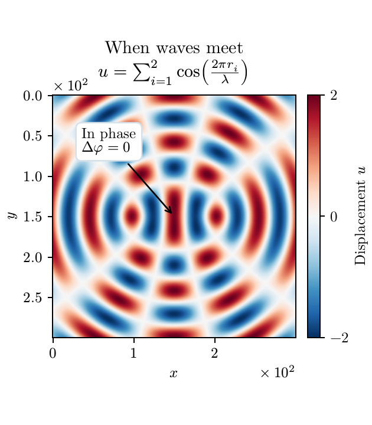

# Plotst

[](https://github.com/Sauerbac/plotst/actions/workflows/ci.yml)

**Typst typography for Matplotlib figures.** Keep your Matplotlib plotting code
and use Typst to typeset labels and mathematics in publication-ready PDFs.

<table>
<tr>
<th>Python</th>
<th>Generated PDF</th>
</tr>
<tr>
<td valign="top">

```python
import matplotlib.pyplot as plt
import plotst

plotst.setup()
u = ...  # Your 2D data

fig, ax = plt.subplots()
image = ax.imshow(u, cmap="RdBu_r", vmin=-2, vmax=2)
ax.ticklabel_format(scilimits=(0, 0), useMathText=True)

ax.annotate("In phase\n$Delta phi = 0$",
            xy=(149.5, 149.5), xytext=(35, 70),
            arrowprops=dict(arrowstyle="->"),
            bbox=dict(boxstyle="round,pad=0.38",
                      facecolor="white", edgecolor="#d6e2eb"))

ax.set(xlabel="$x$", ylabel="$y$")
ax.set_title("When waves meet\n"
             "$u = sum_(i=1)^2 cos((2 pi r_i)/lambda)$",
             pad=12, linespacing=1.6)
fig.colorbar(image, cax=ax.inset_axes([1.05, 0, 0.05, 1]),
             ticks=[-2, 0, 2], label="Displacement $u$")

plotst.savefig(fig, "figure.pdf")
```

</td>
<td valign="middle">

</td>
</tr>
</table>

`plotst.setup()` checks Typst and sets typography defaults: New Computer Modern
text and math fonts at 10 pt. Labels use native Typst syntax, including `$...$`
for math. The [runnable example](examples/readme_example.py) supplies the data
behind `u = ...` and the preview's figure size and layout.
[Browse the gallery →](docs/gallery/README.md)

## Install

Plotst is an early library with PDF-only output, currently verified on Windows
with Python 3.12–3.14. Install [Typst 0.15.0](https://github.com/typst/typst/releases/tag/v0.15.0)
and add it to `PATH`, then install Plotst from GitHub:

```powershell
py -3.12 -m venv .venv
.\.venv\Scripts\python -m pip install "plotst @ git+https://github.com/Sauerbac/plotst.git"
```

Supply your 2D data, save the example as `plot.py`, and run it with
`.\.venv\Scripts\python plot.py`.
See the [installation guide](docs/installation.md) for other Python versions and setup details.

## Explore

- [Gallery](docs/gallery/README.md) — figures, PDFs, and source.
- [Examples](examples/README.md) — setup and commands to run the demonstrations.
- [Usage](docs/usage.md) — fonts, exact export sizes, and custom formatters.
- [Supported figures and limits](docs/support.md).
- [How it works](docs/how-it-works.md) — text measurement and PDF composition.
- [Contributing](CONTRIBUTING.md) — tests, builds, and gallery maintenance.

Plotst is available under the [MIT license](LICENSE).
