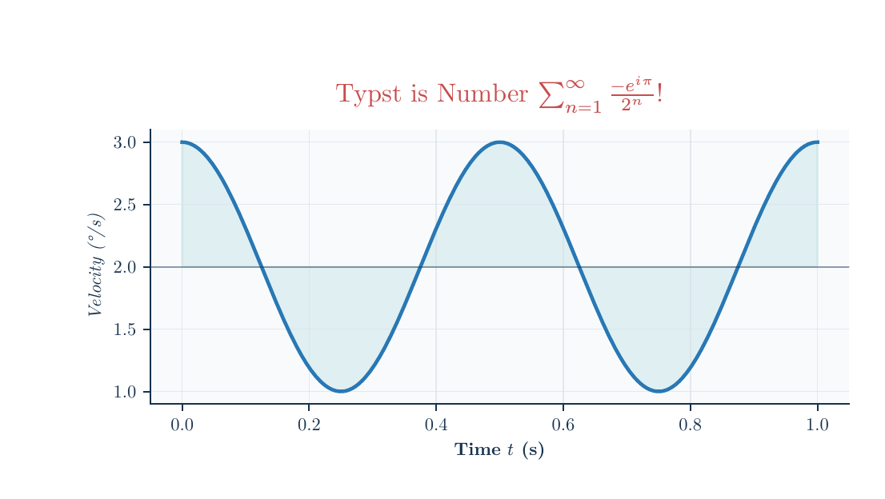

# Plotst

[](https://github.com/Sauerbac/plotst/actions/workflows/ci.yml)

Plotst is an early Python library that uses Typst to measure and typeset text
inside Matplotlib PDF figures. Matplotlib still owns axes, artists, transforms,
legends, and figure layout; Typst supplies the text geometry and the actual PDF
text and mathematics.

Plotst is an early library with PDF-only output. It supports ordinary scientific
figures, native Typst mathematics, and exact physical export sizes.

[](docs/gallery/README.md)

Explore the [example gallery](docs/gallery/README.md) for PDFs, previews, and
runnable source, or read the [support matrix](docs/support.md) for current limits.
The gallery includes playful wave interference, a monkey-saddle landscape,
and a locally computed three-body orbit, alongside column-width plots, heatmaps,
mixed vector/raster panels, and annotations with native Typst mathematics.
The showcases pair Comic Sans MS with Cambria Math and Georgia with New Computer
Modern Math to demonstrate independent text and equation fonts.

## Requirements

- Windows with Python 3.12, 3.13, or 3.14. Package metadata accepts Python 3.12
  and newer; future versions need verification before being considered supported.
- Typst 0.15.0 installed separately and available on `PATH`.
- Matplotlib 3.11.0 and pypdf 6.10.0 (installed with Plotst).
- New Computer Modern text and math fonts (included in the official Typst CLI).

Verified compiler builds are the official `typst 0.15.0 (3ae52774)` release and
the original local `typst 0.15.0 (c98e9103)` build. Other builds trigger a warning.
Windows is the current support target; macOS and Linux have not been verified.

## Install from GitHub

Install the Windows archive from [Typst 0.15.0](https://github.com/typst/typst/releases/tag/v0.15.0),
extract it, and add its directory to `PATH`. Verify it in a new PowerShell window:

```powershell
typst --version
```

With Python and Git installed, create an isolated environment and install Plotst:

```powershell
py -3.12 -m venv .venv
.\.venv\Scripts\python -m pip install "plotst @ git+https://github.com/Sauerbac/plotst.git"
```

You can use `py -3.13` or `py -3.14` instead. Run your scripts with
`.\.venv\Scripts\python`. To reproduce an exact revision, append `@<commit-sha>`
to the Git URL. Plotst is distributed from this repository, not PyPI.

If you prefer not to install Git, download and extract the repository's ZIP,
then run `python -m pip install .` from its root in your Python environment.

## Run the examples

Clone the repository and install [uv](https://docs.astral.sh/uv/getting-started/installation/):

```powershell
git clone https://github.com/Sauerbac/plotst.git
cd plotst
uv sync --locked
uv run python examples\ordinary.py
uv run python examples\column_width.py
uv run python examples\representative_figures.py
uv run python examples\font_showcases.py
uv run python examples\three_body_orbit.py
```

The example writes `output/pdf/plotst-ordinary.pdf` at exactly 120 mm by 80 mm.
Generated files under `output/` are ignored by Git. See
[CONTRIBUTING.md](CONTRIBUTING.md) for tests, builds, and gallery maintenance.
The font and orbit showcases additionally need Windows' Comic Sans MS, Georgia,
and Cambria Math; `typst fonts` lists available families. The orbit is integrated
locally with NumPy, using the linked catalogue's initial conditions, and needs
no network access or additional numerical packages.

## Representative support figures

The example corpus combines common publication use cases into four figures:

```powershell
uv run python examples\representative_figures.py
```

It produces a log/scientific heatmap with a colorbar, a multi-panel mixed
vector/raster figure, an annotation-heavy figure, and a math-rich cosine plot
adapted from Matplotlib's
[LaTeX text example](https://matplotlib.org/stable/users/explain/text/usetex.html).
The last figure uses Typst expressions such as `$sum_(n=1)^oo frac(-e^(i pi),
2^n)$`; Plotst does not interpret LaTeX source or require `text.usetex=True`.
The concise
[support matrix](docs/support.md) records the representative features and links
to the maintained gallery.

## Use Plotst

Call `plotst.setup()` before creating the figure so Matplotlib and Typst begin
with the same typography defaults. Export explicitly through
`plotst.savefig()`.

```python
import matplotlib.pyplot as plt
import plotst

plotst.setup(
    font="New Computer Modern",
    math_font="New Computer Modern Math",
    font_size=10,
)

fig, ax = plt.subplots(
    figsize=(120 / 25.4, 80 / 25.4),
    layout="constrained",
)
ax.plot([0, 1, 2], [0, 1, 4], label="Response $x^2$")
ax.set_xlabel("Time $t$")
ax.set_ylabel("Measured value")
ax.legend()

plotst.savefig(fig, "figure.pdf")
```

Use `layout="constrained"` to let Matplotlib fit the axes, titles, labels, and
colorbars within the requested page size using Typst's text measurements.
The gallery's single-axis examples use this to keep outer whitespace small
while preserving room for their text.

For a paper column with a fixed final width and little outer whitespace, use
`tight_width_mm`. Plotst fits the plotted area to the requested width without
rescaling the fonts. It trims around the title, ticks, labels, legend, and
other included artists with a small safety margin; the PDF height follows the
content. For a complete runnable example, use
[`examples/column_width.py`](examples/column_width.py).

```python
plotst.savefig(fig, "figure-column.pdf", tight_width_mm=85)
```

Calling `setup()` again replaces the active process-wide configuration for
figures created afterward. Loading configuration from a file is deliberately
deferred; the current interface is Python-only.

## Initial supported contract

- Fixed-size Matplotlib PDF figures and content-cropped PDFs at an exact
  requested width in millimeters.
- Ordinary line and scatter figures with linear axes.
- Titles, axis labels, ordinary numeric ticks, legends, rotation, color, and
  constrained layout.
- Built-in scalar and logarithmic ticks, including scientific/additive offsets
  and colorbar ticks produced by Matplotlib's standard formatters.
- Native Typst prose and inline math in user-authored labels.
- One Typst inline label per Matplotlib text line. Use Python `\n` when
  Matplotlib should manage multiple lines.
- Explicit Matplotlib font size, weight, and style overrides applied through
  Typst.
- Mixed vector/raster figures when only non-text artists are rasterized.
- Text clipping, opacity, drawing order, rotation, and URL annotations retained
  in the composed PDF.
- Real PDF text where Typst emits it; the ordinary example is not rasterized.

During an export, Plotst adapts exact instances of Matplotlib's
`ScalarFormatter`, `LogFormatter`, `LogFormatterMathtext`, and
`LogFormatterSciNotation`. Literal output is escaped as text, while the narrow
numeric Mathtext grammar emitted by those formatters is translated to Typst.
The original formatter objects are restored after the export, including after
an error. Formatter subclasses and other custom formatters are not replaced;
they must return valid Typst label content.

Typst-internal multiline blocks, explicit movement, baseline shifts, page
operations, deliberate overflow, arbitrary `bbox_inches` options, rasterized text or
text-containing containers, interactive rendering, SVG/PNG export, and
arbitrary LaTeX/Mathtext conversion are not supported by this first slice.

## How PDF composition works

For each distinct label needed during one export, Plotst asks the Typst CLI for
its measurements and a small PDF containing that label. Matplotlib lays out and
draws the figure using those measurements. pypdf installs the label PDFs as Form
XObjects at the positions already recorded in Matplotlib's drawing stream. This
preserves the tested ordering, clipping, opacity, vector graphics, and PDF text.

The per-export artifact table is discarded after `savefig()` returns. There is
no persistent cache, cross-export cache, batching layer, or cache invalidation
system yet.

## Diagnostics

`setup()` checks the configured Typst executable immediately. During export,
invalid Typst source identifies the failing label and includes the compiler
diagnostic. Typst warnings, including missing-font substitution, are treated as
errors so typography cannot silently change.

## License

Plotst is available under the [MIT license](LICENSE).
