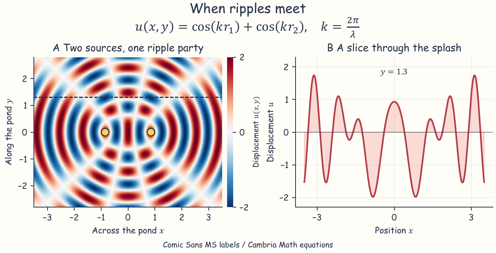
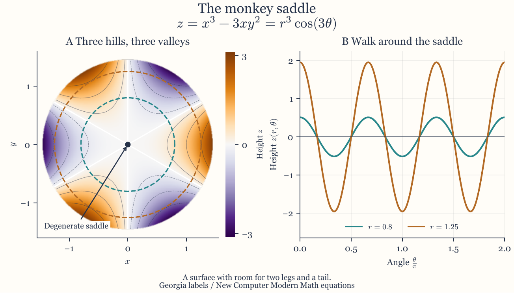
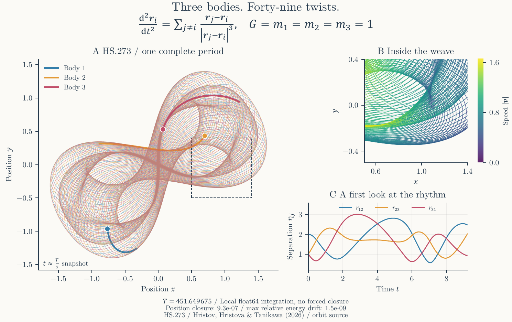
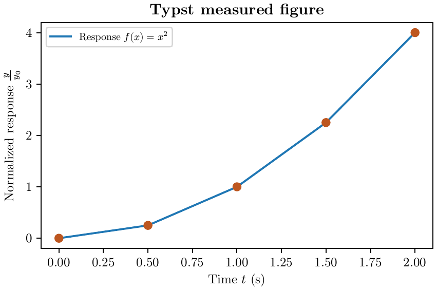
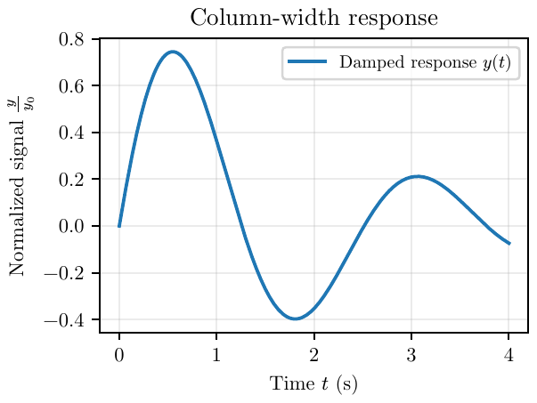
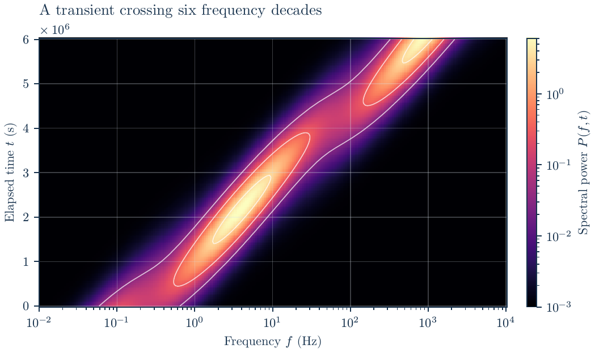
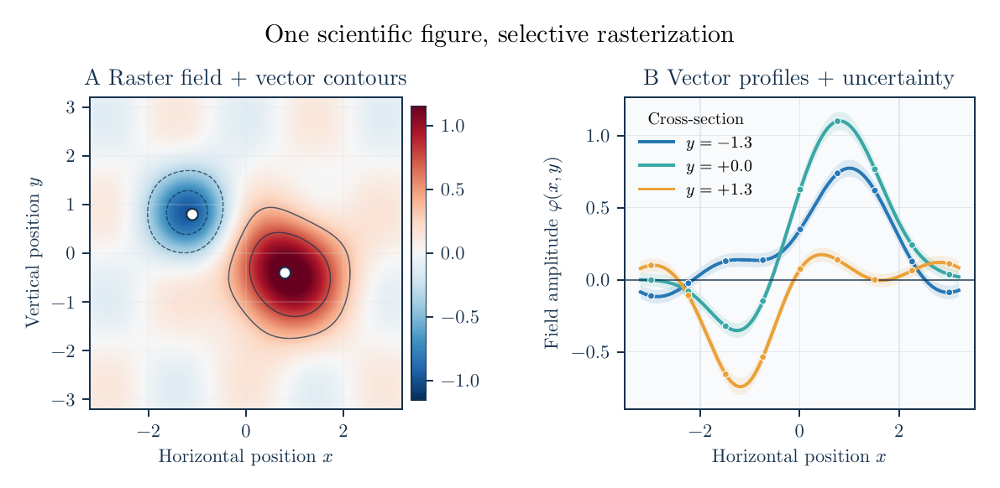
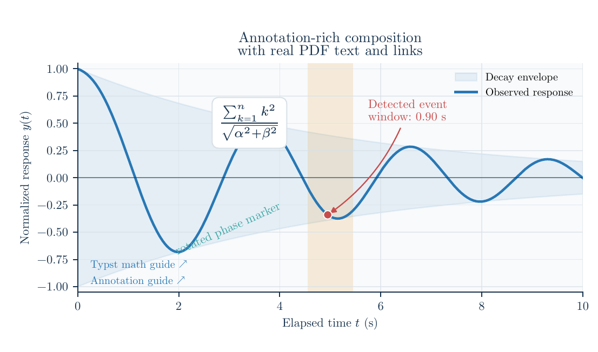

# Plotst gallery

Scientific figures with Matplotlib geometry and Typst typography. Click any
preview to open its PDF. The PDFs retain their physical page sizes and tested
vector/text content; the PNGs are previews for browsing on GitHub.

The single-axis examples and new showcases use constrained layout or a tight
content crop to give the plotted data more room while keeping labels and titles
readable. The showcases also use compact shared headers and footers.
Each example below links to its runnable source.

Run the commands from the repository root after `uv sync --locked`.

## When ripples meet

An idealized equal-amplitude snapshot of two coherent sources makes an
interference landscape. Comic Sans MS gives the labels a playful voice;
Cambria Math keeps the equation and mathematical labels distinct. A raster displacement field sits
under fine vector nodal contours, with marked sources, a colorbar, and a vector
cross-section. 184 x 94 mm, with constrained layout and a slim vertical colorbar.

[Source](../../examples/font_showcases.py) · `uv run python examples/font_showcases.py`

## The monkey saddle

The surface $z = x^3 - 3xy^2$ has three hills and three valleys around a degenerate
saddle. The height map and two circular sections show its threefold symmetry
without requiring 3D axes. Georgia prose and New Computer Modern Math combine an
editorial title with native Typst equations. Raster color, vector contours,
annotation arrows, dashed section paths, and a legend remain in one exact
184 x 105 mm PDF with constrained layout.

[Source](../../examples/font_showcases.py) · `uv run python examples/font_showcases.py`

## Three bodies, forty-nine twists

The [HS.273 orbit](https://www.threebodyorbits.com/orbit/hristov2026_hs273_1_1_1)
is a figure-eight satellite from Hristov, Hristova & Tanikawa's
[stable-orbit search](https://arxiv.org/abs/2510.22802), published in
New Astronomy 125 (2026). Its topological class is `(abAB)^49`; the extra loops
weave a dense pattern over a period of about 451.649675 time units.

This example computes the full orbit from the catalogue's published initial
conditions using a NumPy-only adaptive Dormand-Prince 5(4) integrator. It shows
all three vector trajectories, colored bodies and short trails at a common
snapshot, a speed-colored close-up of the marked region, and pairwise
separations over the first `T/49` time units. New Computer Modern text and
Cambria Math typeset the Newtonian equation, labels, and diagnostics. The
210 x 132 mm PDF uses constrained layout and also includes a clickable source
credit.

The footer reports the **local float64** position-closure residual and maximum
relative energy drift. These are measured from uncorrected numerical states;
they do not reproduce the source's high-precision closure or verify stability.
The upper-right speed colors use a common scale for all three bodies. No
downloaded trajectory, additional numerical dependency, or live network access
is needed to regenerate the figure.

[Source](../../examples/three_body_orbit.py) · `uv run python examples/three_body_orbit.py`

### Showcase fonts

The new examples use Windows' **Comic Sans MS**, **Georgia**, and **Cambria Math**,
plus Typst's bundled **New Computer Modern** families. Check `typst fonts` before
running them. Plotst treats font-substitution warnings as errors, so a missing
family must be installed rather than silently replaced. The existing examples
below only require the bundled New Computer Modern families.

## Typst mathematics

A math-rich title with native Typst syntax, serif prose, bold and italic labels.
156 x 88 mm. Inspired by Matplotlib's
[TeX text example](https://matplotlib.org/stable/gallery/text_labels_and_annotations/tex_demo.html).

[Source](../../examples/representative_figures.py#L333) · `uv run python examples/representative_figures.py`

## An ordinary scientific plot

Constrained layout, inline mathematics, a legend, and an exact 120 x 80 mm page.

[Source](../../examples/ordinary.py) · `uv run python examples/ordinary.py`

## Fit a paper column

An exact 85 mm final width, including labels and legend, with a tight content
crop. Font sizes stay unchanged.

[Source](../../examples/column_width.py) · `uv run python examples/column_width.py`

## Logarithmic and scientific axes

A rasterized heatmap with vector contours, logarithmic ticks, a scientific
multiplier, and a logarithmic colorbar. 148 x 88 mm.

[Source](../../examples/representative_figures.py#L58) · `uv run python examples/representative_figures.py`

## Mixed vector and raster panels

A raster field alongside vector contours, profiles, markers, uncertainty bands,
and a colorbar. 168 x 82 mm.

[Source](../../examples/representative_figures.py#L112) · `uv run python examples/representative_figures.py`

## Annotations and tall mathematics

Arrows, rotated labels, multiline text, native Typst equations, and clickable PDF
links. 156 x 92 mm.

[Source](../../examples/representative_figures.py#L220) · `uv run python examples/representative_figures.py`

See the [support matrix](../support.md) for boundaries and
[contributor guide](../../CONTRIBUTING.md#refresh-the-gallery) to regenerate previews.
